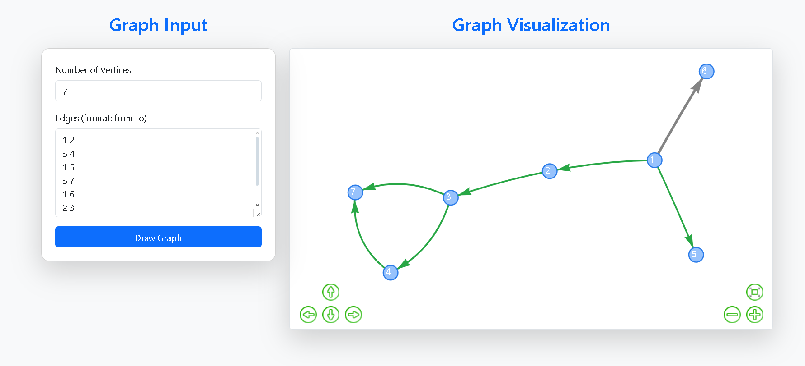

# Graph Visualizer

A simple web-based tool to visualize graphs interactively. Users can input the number of vertices and edges, and the graph will be dynamically created and visualized in real-time. This project helps visualize graph structures with nodes and edges, making it easy to understand graph theory concepts and relationships between elements.

---

## 🛠 Technologies Used

- **HTML5**
- **CSS3**
- **JavaScript (Vanilla)**
- **Vis.js** - JavaScript library for network visualization
- **Bootstrap** - Frontend framework for responsive design

---

## 🔧 Features

- **Interactive Graph Creation**: Users can input the number of vertices and edges to create and visualize graphs in real-time.
- **Customizable Node and Edge Styles**: Nodes are displayed as circles with labels (node numbers) centered inside, and edges are drawn with arrows.
- **Smooth Animations**: Dynamic edge animation as edges are drawn.
- **Responsive Design**: The interface is mobile-friendly, adapting to different screen sizes.

---

#### This web page is hosted [here!](https://luimas007.github.io/graph-visualizer/)

